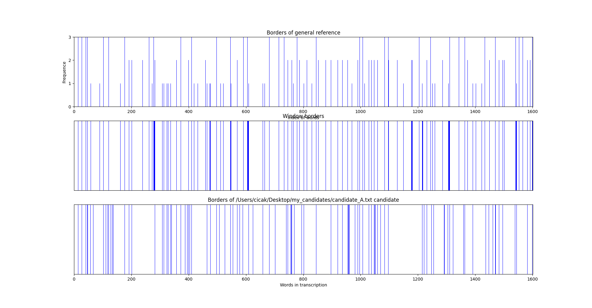

# WiSeBETool - Window based Sentence Boundary Evaluation Toolkit 

**WiSeBETool** is a toolkit to evaluate automatic Sentence Boundary Detection (SBD) systems based on the semi-supervised performance evaluation protocol [WiSeBE](https://doi.org/10.1007/978-3-030-04497-8_10).

WiSeBE considers the multi-reference (dis)agreement of a set of references to create a General Reference (GR) and a set of window borders. You can download the WiSeBE reference paper [here](https://arxiv.org/abs/1808.08850).


You can cite this toolkit as :

> González-Gallardo, C. E., & Torres-Moreno, J. M. (2018, October). WiSeBE: Window-based Sentence Boundary Evaluation. In Mexican International Conference on Artificial Intelligence (pp. 119-131). Springer, Cham.

or download the [Bibtex](https://raw.githubusercontent.com/cic4k/wisebe/main/wisebe.bib "WiSeBE Bibtex").


---

## Installation

```bash
    $ git clone https://github.com/cic4k/wisebe
    $ cd wisebe
    $ python setup.py install
```

---

## Usage

**Display options and get general information of WiSeBETool**

```bash
$ wisebetool -h  
```
Output
```
usage: wisebetool [-h] [-r REFERENCES_DIR] [-m MIN_WINDOW_LIMIT] [-c CANDIDATE_PATH] [-p] [-d]

Window Based Sentence Boundary Evaluation Toolkit (WiSeBETool).

optional arguments:
  -h, --help            show this help message and exit
  -r REFERENCES_DIR, --references_dir REFERENCES_DIR
                        Path to reference folder. Default: ./references/
  -m MIN_WINDOW_LIMIT, --min_window_limit MIN_WINDOW_LIMIT
                        Min distance between window borders. Default: 3
  -c CANDIDATE_PATH, --candidate_path CANDIDATE_PATH
                        Path to candidate segmentation. Default: None
  -p, --plots           Whether or not to plot segmentations
  -d, --dump            Dump segments to file    
```

**Simple execution without candidate segmentation and references in default folder**

```bash
$ wisebetool
```
Output
```
Segmentation ~/wisebe/references/reference_1.txt loaded!
Segmentation ~/wisebe/references/reference_1.txt has 99 borders.
Segmentation ~/wisebe/references/reference_3.txt loaded!
Segmentation ~/wisebe/references/reference_3.txt has 40 borders.
Segmentation ~/wisebe/references/reference_2.txt loaded!
Segmentation ~/wisebe/references/reference_2.txt has 88 borders.
All references look similar :)
**STATS**
- Common borders (cm): 115
- Common borders ponderated (cmp): 188
- Agreement Ratio (AR) AR = cmp / mb : 0.5449
- Max borders (max_b) max_b = cm x |references| : 345
- Fleiss Kappa (K): 0.6347
- Fleiss Kappa in borders (K_borders): -0.0175
```


**Execution with candidate segmentation "\~/Desktop/my_candidates/candidate_A.txt", references in "\~/Desktop/my_references" folder, window borders size equal to 4, plotting and dumping options activated**

```bash
$ wisebetool -c ~/Desktop/my_candidates/candidate_A.txt -r ~/Desktop/my_references -m 4 -p -d 
```
Output
```
Segmentation /Users/cicak/Desktop/my_references/reference_1.txt loaded!
Segmentation /Users/cicak/Desktop/my_references/reference_1.txt has 99 borders.
Segmentation /Users/cicak/Desktop/my_references/reference_3.txt loaded!
Segmentation /Users/cicak/Desktop/my_references/reference_3.txt has 40 borders.
Segmentation /Users/cicak/Desktop/my_references/reference_2.txt loaded!
Segmentation /Users/cicak/Desktop/my_references/reference_2.txt has 88 borders.
All references look similar :)
**STATS**
- Common borders (cm): 115
- Common borders ponderated (cmp): 188
- Agreement Ratio (AR) AR = cmp / mb : 0.5449
- Max borders (max_b) max_b = cm x |references| : 345
- Fleiss Kappa (K): 0.6347
- Fleiss Kappa in borders (K_borders): -0.0175
```


```
Segmentation /Users/cicak/Desktop/my_candidates/candidate_A.txt loaded!
Segmentation /Users/cicak/Desktop/my_candidates/candidate_A.txt has 109 borders.
Candidate and general reference are equal...
Evaluating vs. each reference...
- Reference: /Users/cicak/Desktop/my_references/reference_1.txt
++++++++++
Precision	0.495
Recall	0.545
F1	0.519
s_Precision	0.497
s_Recall	0.547
s_F1	0.521
bs_ws	54.000
bs_nws	55.000
ws_bs	54.000
ws_nbs	45.000
d_ws	337.000
candidate_borders	109.000
wisebe	0.000
s_wisebe	0.000
agreement_borders_ratio	0.000
++++++++++
- Reference: /Users/cicak/Desktop/my_references/reference_3.txt
++++++++++
Precision	0.220
Recall	0.600
F1	0.322
s_Precision	0.221
s_Recall	0.600
s_F1	0.323
bs_ws	24.000
bs_nws	85.000
ws_bs	24.000
ws_nbs	16.000
d_ws	1608.000
candidate_borders	109.000
wisebe	0.000
s_wisebe	0.000
agreement_borders_ratio	0.000
++++++++++
- Reference: /Users/cicak/Desktop/my_references/reference_2.txt
++++++++++
Precision	0.459
Recall	0.568
F1	0.508
s_Precision	0.460
s_Recall	0.569
s_F1	0.509
bs_ws	50.000
bs_nws	59.000
ws_bs	50.000
ws_nbs	38.000
d_ws	472.000
candidate_borders	109.000
wisebe	0.000
s_wisebe	0.000
agreement_borders_ratio	0.000
++++++++++
- Average performance vs. all references
++++++++++
F1	0.450
Precision	0.391
Recall	0.571
++++++++++
Evaluating vs. general referece...
++++++++++
Precision	0.560
Recall	0.567
F1	0.563
s_Precision	0.561
s_Recall	0.569
s_F1	0.565
bs_ws	61.000
bs_nws	48.000
ws_bs	59.000
ws_nbs	45.000
d_ws	252.000
candidate_borders	109.000
wisebe	0.307
s_wisebe	0.308
agreement_borders_ratio	0.545
++++++++++
```


```
Dumping borders to file: /Users/cicak/Desktop/my_references/reference_1.txt.seg
Dumping borders to file: /Users/cicak/Desktop/my_references/reference_3.txt.seg
Dumping borders to file: /Users/cicak/Desktop/my_references/reference_2.txt.seg
Dumping borders to file: /Users/cicak/Desktop/my_references/gral_ref.seg
Dumping borders to file: /Users/cicak/Desktop/my_candidates/candidate_A.txt.seg
```


